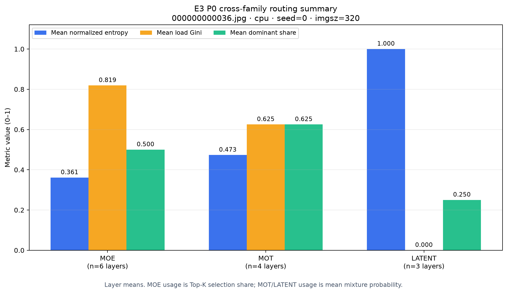

# E3 Routing Observer · P0

腾讯犀牛鸟 E3 路由透视镜的 P0 独立仓库。目标是把 smoke 的一次性验证提炼为可复用基础设施：同一采集接口、同一字段字典、MoE/MoT/Latent 三类结构化日志与静态图。

阶段导航：[Smoke 准入证据](https://github.com/XavierYChen/e3-routing-smoke) · **P0（本仓库）** · [P1 实时面板与训练开销](https://github.com/XavierYChen/e3-routing-p1) · [P2 token 原图叠加与演示](https://github.com/XavierYChen/e3-routing-p2) · [最终报告与消融](https://github.com/XavierYChen/e3-routing-final-report)。

本仓库不复制或修改腾讯核心 forward。运行时通过临时 forward hook 观察锁定的 YOLO-Master checkout，退出上下文后立即移除 hook。

## P0 已有能力

- `RoutingCollector`：自动发现 routed leaf module，并使用三族 adapter。
- MoE 使用最终 top-k dispatch index/weight；MoT/Latent 使用原生 `last_routing_snapshot`。
- `e3.routing_record.v1`：显式区分选择份额和平均混合概率。
- JSON snapshot、可追加 JSONL sink、带三位小数的静态总览图。
- aux loss 缺失使用状态和 `null`，不伪造为 0。
- 非法、非有限、未归一化或 stale 数据直接失败。

## 最新 P0 证据

真实 COCO8 三族运行已经通过：MoE 6 层、MoT 4 层、Latent 3 层，共 13 条统一记录。


这张图是 P0 特有证据：显示三族层数、逐族 schema 校验覆盖率以及可复用 sink。路由数值回归图仍保留在 [routing_snapshot.png](results/verified-p0-cpu-v5-20260906/routing_snapshot.png)，它应与 smoke 在同输入下接近。



跨族图补充展示 13 个路由层的平均归一化熵、负载 Gini 和主导专家占比。它用于快速发现极端均匀或单专家状态，不用于给三族排“优劣”：MOE 的 usage 是 Top-K 选择占比，MOT/LATENT 的 usage 是平均混合概率，图中已把这项语义差异写明。统计来自同一份 `routing_snapshot.json`，没有为图表重新运行或改动模型。

完整产物位于 [results/verified-p0-cpu-v5-20260906](results/verified-p0-cpu-v5-20260906/)。

## 运行

```bat
cd /d D:\AI\E3-Routing-P0
set "E3_YOLO_MASTER_ROOT=D:\AI\YOLO-Master"
set "E3_PYTHON=D:\AI\envs\yolo_master\python.exe"
run_p0.cmd
```

结果保存到新的 `results/run-时间/`。默认使用真实 COCO8、CPU、imgsz=320、seed=0。

测试：

```bat
run_tests.cmd
```

## 验收边界

P0 证明三族可以用统一 contract 记录并生成静态图。训练态长时间写入、TensorBoard/W&B/实时面板和训练减速 <10% 属于 P1；token 路由原图叠加和视频属于 P2。

腾讯基线 commit：`246e79cfe418cfd90f4738bace56b02245dc38f8`。Smoke 证据位于配套的 [e3-routing-smoke](https://github.com/XavierYChen/e3-routing-smoke) 仓库。
